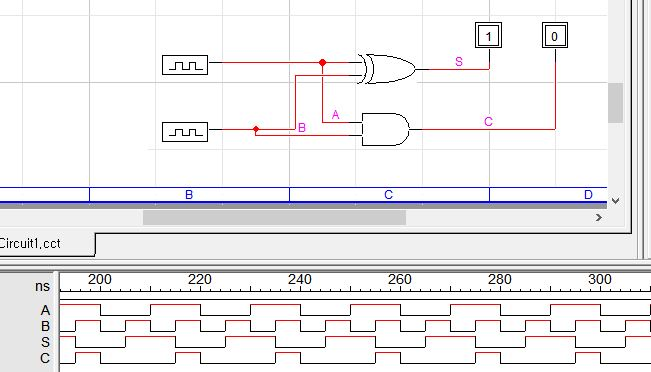
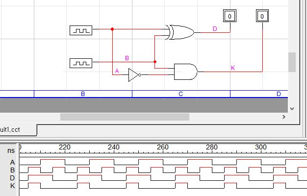
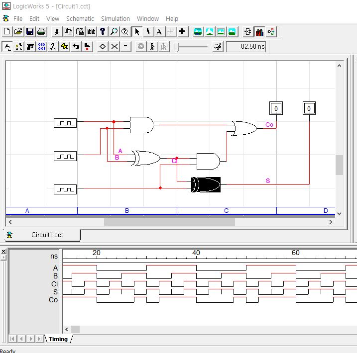

# 5-4 실습 과제
# 13-5 가산기와 감산기 1~3
## 1

|A|B|S|C|
:-|:-:|:-:|:-:|
|0|0|0|0|
|0|1|1|0|
|1|0|1|0|
|1|1|0|1|

## 2

|A|B|D|K|
:-|:-:|:-:|:-:|
|0|0|0|0|
|0|1|1|1|
|1|0|1|0|
|1|1|0|0|

## 3

|A|B|Cᵢ|S|C₀|
:-|:-:|:-:|:-:|:-:|
|0|0|0|0|0|
|0|0|1|1|0|
|0|1|0|1|0|
|0|1|1|0|1|
|1|0|0|1|0|
|1|0|1|0|1|
|1|1|0|0|1|
|1|1|1|1|1|
