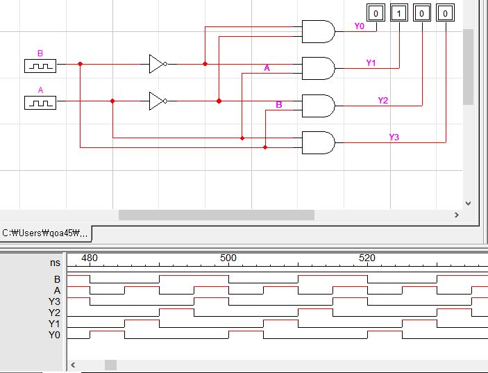
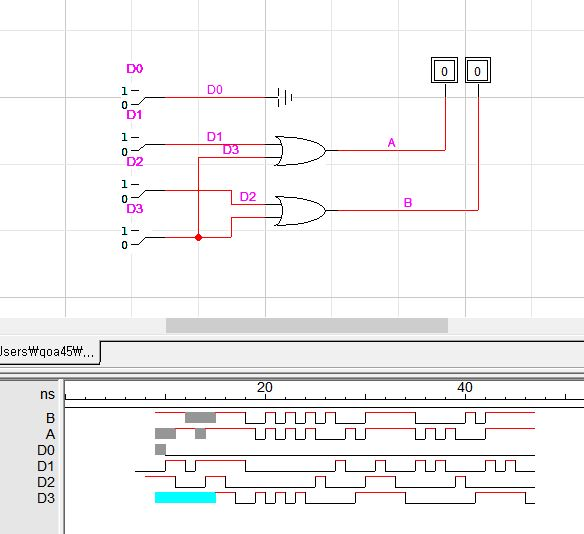
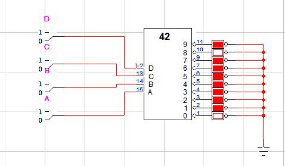

# 7-1
# 13-6장 인코더와 디코더 1~3
## 1

|B|A|Y₃|Y₂|Y₁|Y₀|
:-|:-:|:-:|:-:|:-:|:-:|
|0|0|0|0|0|1|
|0|1|0|0|1|0|
|1|0|0|1|0|0|
|1|1|1|0|0|0|

## 2

|D₃|D₂|D₁|D₀|B|A|
:-|:-:|:-:|:-:|:-:|:-:|
|0|0|0|1|0|0|
|0|0|1|0|0|1|
|0|1|0|0|1|0|
|1|0|0|0|1|1|
## 3

|D|C|B|A|0|1|2|3|4|5|6|7|8|9|
:-|:-:|:-:|:-:|:-:|:-:|:-:|:-:|:-:|:-:|:-:|:-:|:-:|:-:|
|0|0|0|0|O|X|X|X|X|X|X|X|O|X|
|0|0|0|1|X|O|X|X|X|X|X|X|X|O|
|0|0|1|0|X|X|O|X|X|X|X|X|X|X|
|0|0|1|1|X|X|X|O|X|X|X|X|X|X|
|0|1|0|0|X|X|X|X|O|X|X|X|X|X|
|0|1|0|1|X|X|X|X|X|O|X|X|X|X|
|0|1|1|0|X|X|X|X|X|X|O|X|X|X|
|0|1|1|1|X|X|X|X|X|X|X|O|X|X|
|1|0|0|0|O|X|X|X|X|X|X|X|O|X|
|1|0|0|1|X|O|X|X|X|X|X|X|X|O|
